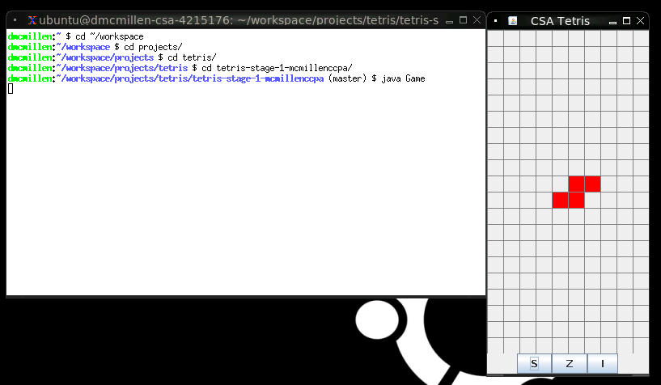
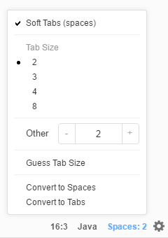

# CSA Tetris - Stage 1

In this project you will complete a full tetris game using the Java programming
language and platform. 
This repository is for the first stage of the project.
In this stage, you will be implementing the S, Z, and I shapes.

### Compiling Stage 1 Code

Run this from your repository directory:

`javac Game.java`

### Running Stage 1 Code

*Log into your C9.io workspace and launch VNC before
attempting to run the application.*

Run this from your repository directory:

`java Game`

### Set your Tab Size to 2 Spaces

When you are writing your Java code, make sure that you set your tab size
to be 2 spaces.

 

### Tasks for Assignment

- [x] Create repository
- [x] Install VNC
- [x] Compile and launch Game
- [ ] Fix SShape.rotate() method: it is not checking whether cells are empty before rotating
- [ ] Implement ZShape and all of its methods. Comment in z code in Grid.java to test your ZShape class.
- [ ] Implement IShape and all of its methods. Comment in i code in Grid.java to test your IShape class.